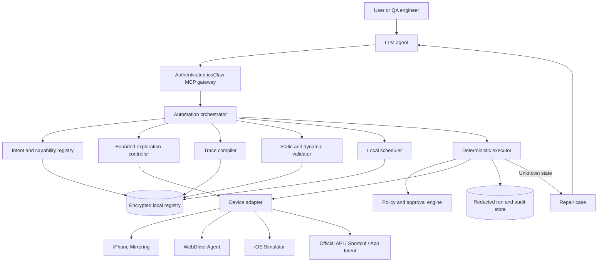

# Technical PRD: Agent-Generated Automations

**Product:** iosClaw  
**Status:** Proposed  
**Owner:** iosClaw  
**Last updated:** 2026-09-08  
**Target:** Local-first generation, execution, repair, and scheduling of semantic iPhone automations

## 1. Decision summary

Add an **Automation Control Plane** to iosClaw that lets LLM agents create,
validate, invoke, repair, and schedule reusable automations through the iosClaw
MCP bridge. Agents provide intelligence at authoring and exception boundaries.
Normal execution remains a deterministic, local state machine.

The governing rule is:

> Agents generate and repair automations. iosClaw validates, authorizes, and
> executes them.

An agent never receives a primitive that accepts screen coordinates, never
interacts with the phone outside iosClaw, never approves its own sensitive
effect, and never changes an active automation in place. A successful discovery
produces a versioned candidate that must pass static and dynamic validation
before promotion.

The initial product is local-first and single-user. The Mac is the automation
host. The iPhone companion remains optional.

## 2. Problem statement

iosClaw can inspect iPhone Mirroring and Simulator, perform semantic actions,
record user-driven flows, and execute a limited compiled-flow catalog. It does
not yet provide a complete lifecycle through which an agent can:

- turn a natural-language goal into an automation definition;
- discover missing application states safely through iosClaw;
- generalize one successful trace into a parameterized flow;
- validate the flow across starting states and UI variations;
- publish and invoke the flow by intent;
- attach reliable local schedules;
- repair a flow after application drift without weakening its safety rules.

Without this lifecycle, agents either plan each action repeatedly or create
one-off scripts. Per-step planning is slow and nondeterministic. One-off code
is expensive to maintain and fragments safety behavior. Raw macro recording is
fast but unsafe when rows, pop-ups, layouts, or app versions change.

The system needs to pay the intelligence cost once, preserve the learned
semantic behavior, and run known tasks without an LLM round trip between steps.

## 3. Product outcomes

### 3.1 Goals

- Generate an automation from a natural-language goal, an iosClaw recording,
  or a combination of both.
- Reuse existing universal primitives, app capability packs, learned context,
  and compiled flows before exploring an application.
- Convert successful exploration into a declarative, parameterized flow rather
  than generated Swift, JavaScript, or coordinate macros.
- Resolve and run known automations through one agent call.
- Schedule automations on a user-owned Mac with explicit missed-run,
  concurrency, approval, and retry policies.
- Invoke an agent only for a new intent, an unknown state, ambiguity, or repair.
- Validate every transition from fresh state evidence and fail closed.
- Keep inputs, screen evidence, flows, schedules, and audit data local by
  default.
- Make automation behavior explainable through redacted plans and run traces.

### 3.2 Non-goals

- Guarantee automation of every iOS application or security-sensitive screen.
- Bypass iOS, iPhone Mirroring, macOS permissions, Face ID, passcodes, CAPTCHA,
  DRM, app anti-automation controls, or enterprise device policy.
- Allow an agent to click directly in iPhone Mirroring, Simulator, or a target
  app outside iosClaw.
- Store actionable coordinates in learned context or automation packages.
- Let an agent authorize send, post, purchase, delete, account, or security
  effects.
- Store passwords, passcodes, one-time codes, payment-card secrets, or
  biometric material.
- Require a cloud control plane, an iPhone companion, WebDriverAgent, or
  provisioning for the consumer path.
- Run schedules while the Mac is powered off, logged out, or unable to access a
  declared device source.
- Generate application source code for every flow.

## 4. Users and use cases

### 4.1 End user

- Teach a recurring personal workflow once and call it later by name or intent.
- Schedule a read-only check, navigation task, or form preparation.
- Prepare a message or post automatically and approve the final external effect.
- Review what an automation will do, which values it uses, and why it stopped.

### 4.2 QA engineer

- Generate navigation and form-entry automations against Simulator.
- Parameterize test accounts, fixtures, locales, and device configurations.
- Schedule regression flows and retain assertions, screenshots, and timings.
- Repair selectors after an app update and validate the candidate before use.

### 4.3 Application-pack author

- Teach reusable app states and capabilities through safe exploration.
- Publish signed, input-free capability packs that many flows can reuse.
- Validate a pack against supported app versions and device matrices.

## 5. Core user journeys

### 5.1 Generate from a request

1. The user describes the goal, optional trigger, and constraints.
2. The agent calls `automation.draft` with a structured intent specification.
3. iosClaw searches the registry for reusable flows, capabilities, and app
   knowledge.
4. If everything is known, the compiler produces a candidate without device
   input.
5. If knowledge is missing, iosClaw creates a capability-scoped exploration
   session on Simulator by default.
6. The agent observes and invokes only permitted iosClaw semantic actions.
7. iosClaw records before-state, action intent, after-state, evidence, timing,
   and effect classification.
8. The compiler parameterizes variable values, merges states, adds assertions,
   and emits an immutable draft version.
9. Static validation and the requested dynamic validation matrix run.
10. The user reviews the redacted behavior and activates the validated version.

### 5.2 Generate from a demonstration

1. The user starts Teach mode and performs every device action through iosClaw.
2. The semantic recorder captures the successful trace without coordinates.
3. An agent proposes the intent name, input parameters, optional branches, and
   reusable capabilities.
4. The same compiler, validator, review, and promotion lifecycle applies.

### 5.3 Invoke a known automation

1. The user or agent submits an intent and run-only inputs.
2. The resolver selects exactly one active, compatible automation version.
3. iosClaw performs preflight, acquires the device lease, and binds inputs.
4. The local executor runs known transitions without returning to the agent.
5. iosClaw pauses at an interactive approval boundary if required.
6. The runtime verifies the terminal state and returns one redacted result.

### 5.4 Schedule an automation

1. The agent translates a natural-language schedule into a normalized trigger
   and presents it in local time.
2. iosClaw validates that the automation is active and schedulable.
3. The user reviews recurrence, input bindings, missed-run behavior, and effect
   policy.
4. The local scheduler persists the trigger and calculates `nextRunAt`.
5. At execution time, iosClaw performs a fresh preflight and runs the bound
   automation or records a precise missed/blocked result.

### 5.5 Repair after drift

1. A run stops on an unknown state, unresolved target, or failed postcondition.
2. iosClaw stores a redacted repair case and leaves the active package unchanged.
3. With user policy permitting, a repair agent explores within a bounded
   session and proposes a new inactive version.
4. Regression validation covers old fixtures plus the new state.
5. Promotion is atomic; rollback remains available.

## 6. Architecture



### 6.1 Architecture style

Use a modular local application for the MVP, not microservices. The existing
Swift macOS application owns capture, input, policy, encrypted persistence, and
the current compiled runtime. New modules communicate through typed internal
protocols so a separate local daemon can be introduced later without changing
the flow package or agent API.

### 6.2 Trust boundaries

1. **Agent boundary:** untrusted planner output. All requests are schema
   validated, capability scoped, budgeted, and policy checked.
2. **Control-plane boundary:** drafts, schedules, versions, and repair cases.
   It cannot inject physical input except through the runtime.
3. **Execution boundary:** the only component allowed to acquire a device lease
   and call adapter primitives.
4. **Approval boundary:** sensitive approvals originate only from trusted local
   iosClaw UI and are bound to the exact effect fingerprint.
5. **Device boundary:** adapters expose capabilities and semantic observations;
   adapter-specific details never weaken runtime policy.

## 7. Component requirements

### 7.1 Agent gateway

Extend the existing versioned, loopback-only authenticated MCP bridge.

Requirements:

- issue short-lived session capability scopes: `observe`, `author`, `validate`,
  `run`, `schedule`, and `repair`;
- reject unknown fields and unsupported schema versions;
- accept semantic identifiers and opaque live target IDs, never coordinates;
- redact secret and run-only values from responses;
- enforce request IDs, replay protection, payload limits, and operation budgets;
- expose long-running generation and validation as resumable jobs;
- make every mutating call attributable in the audit trail.

### 7.2 Intent specification

Agents submit an `AutomationIntentSpec`, not executable actions:

```json
{
  "schemaVersion": 1,
  "intentID": "zency.registration.start",
  "displayName": "Start Zency registration",
  "goal": "Open Zency, enter the configured phone number, and continue",
  "app": {
    "displayName": "Zency",
    "bundleID": "com.witnessmanera.zency"
  },
  "inputs": {
    "phone_number": {
      "type": "secretString",
      "retention": "runOnly",
      "required": true
    }
  },
  "terminalEvidence": ["verification_screen"],
  "maximumEffect": "accountOrSecurity",
  "preferredSource": "simulator"
}
```

The goal text is descriptive only. Executable behavior comes from validated
capabilities and compiled transitions.

The proposed automation taxonomy extends the current compiled-flow effects with
an explicit read-only class: `observe`, `navigate`, `draft`,
`externalCommunication`, `destructive`, `financial`, and
`accountOrSecurity`. App-pack and runtime policy may raise an effect but never
lower it. For example, entering a phone number may be a draft, while tapping a
Continue control that requests an OTP is an account/security effect.

### 7.3 Reuse resolver

Before exploration, resolve in this order:

1. exact active automation intent;
2. compatible compiled-flow template;
3. compatible app capability pack;
4. encrypted user-learned states and transitions;
5. bounded agent exploration.

Resolution must return zero or one result. Ambiguity stops generation or asks
for user disambiguation without device input.

### 7.4 Bounded exploration controller

Exploration is an iosClaw-owned session with explicit limits:

- source and device;
- allowed applications;
- allowed primitive and effect classes;
- maximum actions, observations, duration, and recovery attempts;
- required starting checkpoint;
- whether local screenshots may be exposed to the selected agent;
- whether application data may be mutated;
- cleanup or reset behavior for Simulator fixtures.

Read and navigation actions may be allowed by policy. External, destructive,
financial, account, and security effects always stop for local user approval or
remain unavailable. Credential, OTP, passcode, payment-card, biometric, CAPTCHA,
and DRM states terminate exploration.

### 7.5 Semantic trace recorder

Record each successful discovery transition as:

```text
fresh observation
  -> canonical state and evidence
  -> semantic action and bound example value
  -> adapter result
  -> fresh post-action observation
  -> verified or failed postcondition
```

Trace storage requirements:

- no persistent actionable coordinates;
- values classified before persistence;
- run-only and secret examples replaced with opaque references;
- screenshots and UI trees encrypted separately with retention controls;
- monotonic timestamps for performance analysis;
- source, app identity, device class, locale, appearance, and app version when
  reliably observable.

### 7.6 Trace compiler

The compiler transforms one or more traces into the existing
`CompiledFlowPackage` IR.

It must:

- generalize literals into typed inputs;
- infer reusable state predicates from stable evidence across traces;
- reject unstable evidence such as time, notification counts, and example data;
- replace transient target geometry with semantic locator cascades;
- merge equivalent states and declared entry paths;
- add preconditions, postconditions, bounded timeouts, and retry limits;
- classify effects independently of the agent-provided classification;
- require approval gates for sensitive effects;
- mark inferred branches explicitly rather than silently inventing behavior;
- emit provenance linking every generated element to trace or pack evidence;
- produce an inactive immutable version.

Generation uses data, not per-flow source-code generation. New application code
is added only for shared primitives or adapter capabilities.

### 7.7 Validator

Static validation is mandatory for every version:

- supported schema and primitive ABI;
- no coordinate or unrestricted script literals;
- all required inputs declared and retention-compatible;
- bounded cycles, retries, waits, and action counts;
- satisfiable entry and terminal states;
- postconditions for every input-producing action;
- policy-derived effect classification and approval gates;
- source and adapter capability compatibility;
- no secret values in package, logs, or response fixtures.

Dynamic validation initially runs on Simulator. A validation matrix may include:

- multiple starting states;
- clean and warm application launches;
- compact and large device classes;
- light and dark appearance;
- two Dynamic Type sizes;
- supported locales;
- permission prompts, keyboard presence, banners, and known pop-ups;
- reordered lists and off-screen targets;
- network slow, unavailable, and application-error states.

Physical-device validation is recorded separately and never inferred from
Simulator success.

### 7.8 Automation registry

The registry stores immutable automation versions and mutable lifecycle metadata.

Version lifecycle:

```text
draft -> validating -> validated -> active
   |          |            |         |
   +----------+------------+---------+-> quarantined
                                         |
                                         +-> archived
```

Only one version of an automation may be active for a compatibility bucket.
Promotion and rollback are atomic. Active versions cannot be edited. A repair
always produces a new draft.

### 7.9 Deterministic executor

Reuse and extend `CompiledFlowExecutor`.

Requirements:

- one exclusive device lease per run;
- one fresh, source-bound entry observation;
- local intent binding and flow resolution;
- no per-step agent or MCP round trip for known transitions;
- cached observation reuse only while its generation remains valid;
- condition-driven waits for declared postconditions;
- idempotency keys for externally visible effects;
- checkpoints before sensitive boundaries;
- cancellation and manual-takeover detection;
- redacted terminal result and per-step timings;
- safe stop when any invariant fails.

### 7.10 Local scheduler

Run scheduling from a login-scoped macOS background service owned by iosClaw.
Use a local SQLite schedule table as the source of truth; use `launchd` to keep
the scheduler available while the user is logged in. Do not make Codex,
ChatGPT, or a cloud scheduler a runtime dependency.

Trigger types for MVP:

- one-time local date and time;
- recurring calendar rule with IANA timezone;
- manual run;
- application/test-suite event submitted through authenticated local API.

Required schedule semantics:

- preserve the user's timezone and handle daylight-saving transitions;
- calculate and persist the next occurrence transactionally;
- support missed-run policies: `skip`, `runWhenReady`, or `expire`;
- support overlap policies: `skip`, `queueOne`, or `replacePending`;
- apply one bounded retry policy only to declared transient failures;
- run preflight before acquiring the device lease;
- never treat a schedule as approval for a sensitive effect;
- pause at an approval boundary and expire safely when approval is not provided;
- record `missed`, `blocked`, `expired`, and `cancelled` as terminal outcomes;
- recalculate schedules after clock, timezone, sleep, restart, or app-version
  changes.

The scheduler does not promise execution while the Mac is powered off, logged
out, locked when UI access is required, or disconnected from the device. The
missed-run policy determines behavior after recovery.

### 7.11 Repair controller

Repair is exception handling, not normal execution.

- create a repair case only after declared recovery is exhausted;
- freeze the failure observation and compatible redacted trace;
- retain the last known-good version;
- enforce the same exploration capability and effect limits;
- require regression fixtures from the last known-good version;
- reject a candidate that fixes one state by weakening identity or target
  evidence;
- quarantine automatically on wrong-target indication, approval-binding
  violation, or safety-significant postcondition mismatch;
- require explicit promotion policy before a repaired version becomes active.

## 8. Proposed agent API

MCP names use the current `iosclaw_` prefix. Internally, use the dotted method
names shown below.

| MCP tool | Internal method | Effect |
| --- | --- | --- |
| `iosclaw_automation_draft` | `automation.draft` | Create an inactive draft from an intent specification |
| `iosclaw_automation_generation_status` | `automation.generation.status` | Read generation job state and redacted findings |
| `iosclaw_automation_explore_start` | `automation.explore.start` | Start a bounded teach/discovery session |
| `iosclaw_automation_explore_stop` | `automation.explore.stop` | End exploration and finalize its semantic trace |
| `iosclaw_automation_compile` | `automation.compile` | Compile traces and reusable capabilities into a draft version |
| `iosclaw_automation_validate` | `automation.validate` | Run static and selected dynamic validation |
| `iosclaw_automation_list` | `automation.list` | List redacted automation/version metadata |
| `iosclaw_automation_describe` | `automation.describe` | Explain inputs, effects, compatibility, and evidence |
| `iosclaw_automation_promote` | `automation.promote` | Activate a validated version; local user/admin policy required |
| `iosclaw_automation_quarantine` | `automation.quarantine` | Disable a suspect version without deleting evidence |
| `iosclaw_automation_run` | `automation.run` | Resolve and execute one active automation |
| `iosclaw_automation_run_status` | `automation.run.status` | Read redacted progress, approval state, and timings |
| `iosclaw_automation_cancel` | `automation.cancel` | Cancel a queued or running automation |
| `iosclaw_automation_schedule_create` | `automation.schedule.create` | Create an inactive or active local trigger |
| `iosclaw_automation_schedule_list` | `automation.schedule.list` | List schedule metadata and next occurrence |
| `iosclaw_automation_schedule_update` | `automation.schedule.update` | Update trigger or run policy using optimistic versioning |
| `iosclaw_automation_schedule_pause` | `automation.schedule.pause` | Pause future runs without deleting history |
| `iosclaw_automation_repair_start` | `automation.repair.start` | Start a bounded repair job for a failed run |

Approval decisions remain available only through trusted iosClaw UI. They are
not exposed as an agent tool.

## 9. Data model

Use SQLite for indexed metadata and encrypted files/blobs for large artifacts.
No graph database or cloud database is required for MVP.

### 9.1 `automations`

- `id`
- `intent_id`
- `display_name`
- `owner_scope`
- `active_version_id`
- `created_at`, `updated_at`

### 9.2 `automation_versions`

- `id`, `automation_id`, `version`
- `schema_version`, `primitive_abi_version`
- `status`
- `compiled_package_ciphertext`
- `content_hash`, `signature`
- `provenance`
- `compatibility_manifest`
- `created_at`, `validated_at`, `promoted_at`, `quarantined_at`

### 9.3 `generation_jobs`

- `id`, `intent_spec_ciphertext`
- `state`, `agent_session_id`
- `source`, `device_id`, `app_identity`
- `action_budget`, `deadline`
- `result_version_id`, `failure_reason`
- `created_at`, `completed_at`

### 9.4 `semantic_traces`

- `id`, `generation_job_id`
- `source_context`, `app_context`
- `encrypted_trace`
- `artifact_retention_class`
- `created_at`

### 9.5 `schedules`

- `id`, `automation_id`, `pinned_version_id` nullable
- `status`, `trigger_type`, `trigger_payload`
- `timezone`, `next_run_at`, `last_run_at`
- `input_bindings_ciphertext`
- `missed_run_policy`, `overlap_policy`, `retry_policy`
- `preferred_source`, `device_selector`
- `revision`, `created_at`, `updated_at`

### 9.6 `automation_runs`

- `id`, `automation_id`, `version_id`, `schedule_id` nullable
- `idempotency_key`
- `triggered_at`, `started_at`, `completed_at`
- `state`, `terminal_outcome`, `failure_class`
- `redacted_input_fingerprint`
- `device_id`, `source`, `adapter`
- `timing_summary`, `trace_reference`

### 9.7 `repair_cases`

- `id`, `failed_run_id`, `last_good_version_id`
- `failure_state_fingerprint`
- `status`, `agent_session_id`
- `candidate_version_id`, `resolution_summary`
- `created_at`, `completed_at`

Secret values are stored in Keychain or encrypted run/schedule bindings. They
must not appear in flow packages, SQLite cleartext columns, ordinary audit
events, MCP responses, crash reports, or analytics.

## 10. Run state machine

```text
queued
  -> preflight
  -> waitingForDevice
  -> running
  -> waitingForApproval
  -> running
  -> succeeded

Any non-terminal state may become:
  failed | cancelled | expired | missed | quarantined
```

State transitions are persisted before publishing status. A process restart
must recover queued work, mark orphaned device leases expired, and never repeat
an effect whose idempotency record indicates an uncertain or successful commit.

## 11. Safety and privacy requirements

- Policy decisions are recomputed by iosClaw; agent-provided effect metadata is
  advisory.
- Read, observation, and navigation may run unattended according to user policy.
- External communication, destructive, financial, account, and security effects
  require a fresh interactive approval bound to target, content fingerprint,
  source, automation version, step, and expiration.
- Drafting is distinct from sending.
- An approval expires on UI state change, target/content mutation, source
  change, timeout, or manual takeover.
- Scheduled execution never broadens an automation's permissions.
- Screenshots, OCR, accessibility trees, and trace artifacts stay local unless
  the user explicitly opts into agent exposure.
- Agent-visible observations should prefer redacted semantic summaries. Raw
  screenshots are disclosed only for an authorized exploration or repair job.
- Every agent call, version change, schedule mutation, approval request, and
  run outcome is auditable.
- Deletion follows the existing uninstall/data-removal guarantees.

## 12. Reliability and failure handling

| Failure | Required behavior |
| --- | --- |
| No reusable capability | Offer or start explicitly authorized bounded exploration |
| Ambiguous automation match | Stop and request disambiguation; no device input |
| App not installed | Fail preflight with the required app identity |
| Mac locked or permission unavailable | Mark blocked/missed according to trigger policy |
| Device disconnected | Wait within declared deadline, then stop |
| Device already leased | Apply overlap policy; never interleave input |
| Unknown entry state | Run declared recovery, then stop and create a repair case |
| Missing or duplicate target | Stop; do not use fuzzy coordinates |
| Postcondition failure | Do not report success; retry only if declared and safe |
| Agent generation timeout | Preserve draft trace and fail without activation |
| Sensitive approval absent | Pause until expiry, then stop without effect |
| Manual user takeover | Pause or cancel according to policy; invalidate live targets |
| Mac sleep/restart | Recompute occurrences and apply missed-run policy |
| App version drift | Exclude incompatible package or quarantine on regression |
| Uncertain external effect | Do not retry automatically; require reconciliation |
| Audit persistence failure | Stop before an unaudited mandatory effect |

## 13. Performance requirements

### 13.1 Known automation

- local intent/registry resolution P50 below 50 ms and P95 below 150 ms;
- scheduler dispatch within 1 second of due time when the Mac and device are
  ready;
- action dispatch overhead P50 below 200 ms, excluding target-app transition;
- zero LLM calls between known transitions;
- one agent-to-iosClaw run call for a normal known automation;
- reuse stable observations and warm adapter sessions;
- reduce full-frame recognitions and bridge calls by at least 60% relative to
  primitive-by-primitive agent execution for the reference flow.

### 13.2 Generation and repair

- generation may be asynchronous and prioritizes correctness over interaction
  latency;
- return job acceptance within 500 ms;
- publish meaningful progress at phase boundaries, not every agent thought or
  device action;
- default exploration budget: 40 actions, 5 minutes, one app, Simulator;
- default repair budget: 20 actions and 3 minutes;
- enforce hard time and action limits locally even if the agent disconnects.

### 13.3 Resource limits

- one active input-producing run per device;
- bounded local artifact storage with configurable retention;
- no always-on screen recording when no run, teach, or repair session exists;
- no background LLM polling for schedules.

## 14. Observability

Collect locally:

- generation duration by reuse, exploration, compile, and validation phase;
- flow-resolution hit/miss/ambiguity rate;
- runs completed without agent involvement;
- P50/P95/P99 per primitive and end-to-end run;
- recognition count and cache reuse per run;
- validation pass rate by compatibility bucket;
- repair frequency and repair promotion success;
- scheduler delay, missed runs, overlap outcomes, and approval expiry;
- wrong-target indications, stale-target rejections, and policy stops.

Telemetry export is opt-in, aggregate, and redacted. Raw screen content,
contacts, messages, entered values, and secret fingerprints are never exported.

## 15. Validation plan

### 15.1 Compiler and schema tests

- round-trip every supported intent, trace, package, schedule, and version;
- reject coordinates, unrestricted scripts, unknown fields, invalid effects,
  missing postconditions, unbounded loops, and undeclared inputs;
- verify parameterization removes example secret values;
- property-test that active versions remain immutable.

### 15.2 Agent adversarial tests

- agent requests a raw coordinate action;
- agent misclassifies Send as navigation;
- agent tries to approve its own action;
- agent expands exploration to another app;
- agent exceeds action or time budget;
- agent proposes a weaker locator after repair;
- agent includes a secret in a flow name, log field, or package literal.

Every case must be rejected or redacted by iosClaw independently of the model.

### 15.3 Dynamic automation tests

Use Simulator-first fixtures for:

- Zency form entry with parameterized phone number;
- Contacts search and selection without mutation;
- Files navigation and visible-state assertion;
- Settings navigation across reordered categories;
- Safari start-page and search-field navigation;
- messaging draft with dynamic recipient row order and approval-gated Send.

Each promoted flow must pass from all declared entry states and fail safely on
unsupported states.

### 15.4 Scheduler tests

- timezone and daylight-saving transitions;
- Mac sleep across one or multiple occurrences;
- restart immediately before and after due time;
- duplicate trigger delivery and idempotency;
- device lease contention;
- disconnected device recovery;
- approval expiry;
- schedule update racing with dispatch;
- pinned version versus latest-compatible version;
- missed-run and overlap policy matrix.

### 15.5 Fault injection

Inject immediately before dispatch and after adapter acknowledgement:

- stale or moved capture source;
- app switch and manual takeover;
- target duplication or disappearance;
- permission revocation;
- adapter disconnect;
- audit-store failure;
- runtime crash;
- unknown effect outcome.

The required result is safe stop, deterministic reconciliation, or declared
recovery—never silent continuation or duplicate external effect.

## 16. Success metrics and release gates

### 16.1 Product metrics

- at least 80% of repeated known tasks start without exploration;
- at least 95% verified completion inside each declared compatibility bucket;
- at least 90% of successful known runs have no LLM step decision;
- median time to generate and validate a simple three-to-five-step Simulator
  automation below 3 minutes;
- user can understand inputs, effects, trigger, and stopping reason without
  reading a raw trace.

### 16.2 Safety release gates

- wrong-target action rate: zero in validation and release-blocking in production;
- sensitive effects without a valid bound approval: zero;
- secret values in packages, logs, MCP responses, or analytics: zero;
- stale target dispatch in fault injection: zero;
- automatic retry of an uncertain external effect: zero;
- an agent cannot bypass iosClaw input, policy, validation, or approval APIs.

### 16.3 MVP exit criteria

- one agent can generate a parameterized automation from an intent plus
  Simulator exploration entirely through iosClaw;
- the generated package passes static validation and a declared dynamic matrix;
- activation, invocation, run status, cancellation, and quarantine work through
  versioned APIs;
- one-time and recurring schedules survive app restart and apply missed-run and
  overlap policies correctly;
- scheduled read/navigation flow runs unattended when preflight succeeds;
- scheduled sensitive flow pauses for local approval and expires safely;
- failure produces a bounded repair case and never modifies the active version;
- all lifecycle actions appear in the local audit.

## 17. Delivery plan

### Phase 0 — contracts and persistence

- Define `AutomationIntentSpec`, lifecycle job models, scheduler models, and MCP
  schemas.
- Add SQLite schema and encrypted artifact references.
- Add agent capability scopes and operation budgets.
- Extend static validation for automation and schedule invariants.

### Phase 1 — generation vertical slice

- Implement reuse resolution and bounded Simulator exploration.
- Connect semantic traces to the existing recorded-flow compiler.
- Generate a Zency form-entry draft with run-only phone input.
- Add validation job, version promotion, rollback, and quarantine.

### Phase 2 — invocation and scheduling

- Add automation resolver, one-call run API, cancellation, and status.
- Add login-scoped local scheduler, preflight, missed-run policy, overlap policy,
  and restart recovery.
- Ship read/navigation scheduled flows first.

### Phase 3 — approval and repair

- Add resumable interactive approval inside compiled runs.
- Bind approvals to automation version, step, target, content, and source.
- Add repair cases and agent-generated candidate versions.
- Run regression fixtures before promotion.

### Phase 4 — reusable packs and scale

- Extract form, list, search, settings, document, and messaging capabilities.
- Add signed app-pack distribution without private inputs or artifacts.
- Add multi-device queues while preserving one lease per device.
- Consider an optional encrypted remote trigger plane only after local reliability
  gates are met.

## 18. Technical decisions

| Decision | Choice | Rationale |
| --- | --- | --- |
| Flow representation | Existing versioned declarative IR | Reuses runtime and validator; avoids per-flow code |
| Intelligence placement | Authoring and repair boundaries | Removes per-step latency and nondeterminism |
| Default generation source | Simulator | Resettable, observable, safe for QA fixtures |
| End-user execution source | iPhone Mirroring where supported | No provisioning or companion requirement |
| Developer adapter | Optional WebDriverAgent | Strong accessibility semantics for owned test devices |
| Scheduler | Local SQLite-backed service under `launchd` | Reliable while logged in; no cloud dependency |
| Metadata store | SQLite | Transactional schedule/version/run state without operational overhead |
| Secrets | Keychain plus encrypted bindings | Keeps values out of packages and logs |
| Approval origin | Trusted iosClaw UI only | Agent and schedule cannot self-authorize effects |
| Repair behavior | New inactive version | Preserves rollback and prevents live mutation |

## 19. Deployment and cost model

### 19.1 Local deployment

- Ship the automation modules inside the signed iosClaw macOS application.
- Install a login-scoped scheduler helper or LaunchAgent signed under the same
  stable developer identity and bundle-designated requirement.
- Keep the agent gateway bound to loopback with a rotated user-private token.
- Apply transactional, forward-compatible SQLite migrations before enabling a
  new scheduler or package schema.
- Preserve TCC identity across Debug and Release installation workflows.
- Roll out generation, scheduling, sensitive approval/resume, and repair behind
  independent feature flags.
- Retain the prior application and database backup until migration and startup
  health checks complete.

### 19.2 Operating cost

- Local execution, scheduling, storage, OCR, and Simulator validation require
  no hosted infrastructure for the MVP.
- LLM usage is variable and occurs only during generation or repair. Enforce
  per-job token, time, observation, and action budgets.
- Bundled or local intent matching can remove model usage for known requests.
- Optional remote triggers or shared-pack distribution are later services with
  separately measurable hosting, authentication, and compliance costs.
- The dominant product cost is engineering and validation of app packs across
  application versions—not compute for registry lookup or flow execution.

## 20. Risks and mitigations

### UI churn and pack maintenance

The primary scaling cost is validation across app versions, not registry lookup.
Mitigate with shared capabilities, compatibility buckets, fixtures, canary
promotion, automatic quarantine, and regression-driven repair.

### Agent overreach

Treat all model output as untrusted. Enforce schemas, capabilities, budgets,
effect policy, and device leases below the agent boundary.

### Scheduler expectations

Users may expect phone-like always-on execution. State Mac/device prerequisites
in the schedule UI, show the next occurrence and readiness, and make missed-run
behavior explicit.

### False success

An adapter acknowledgement is not terminal success. Require fresh semantic
postconditions and distinguish `launched`, `captured`, `verified`, and
`completed` in every API and trace.

### Secret leakage

Classification mistakes can occur during generation. Run independent secret
scanning before persistence and promotion, and expose only redacted summaries
to agents.

### Duplicate external effects

Device acknowledgement can be lost after the effect occurs. Require
idempotency records and application-specific reconciliation; never retry an
uncertain effect automatically.

## 21. Open questions

- Which automation classes may be activated without an explicit user review?
- Should a schedule pin an exact flow version by default or follow the latest
  compatible active version?
- Which local model, if any, should handle low-risk intent matching and basic
  parameter inference offline?
- What is the minimum validation matrix required for a private user automation
  versus a distributable app pack?
- Which Simulator reset strategy preserves useful fixtures while keeping
  generation reproducible?
- How should user-approved raw screenshot access be scoped and expired for an
  external agent?
- When the Mac is locked, which read-only adapters remain safe and technically
  available?
- What application-specific reconciliation evidence is sufficient after an
  uncertain message, post, purchase, or deletion?

None of these questions blocks Phase 0. The MVP should use conservative
defaults: explicit activation review, exact-version schedule pinning, no raw
screenshot disclosure unless authorized, and no automatic retry for uncertain
external effects.

## 22. Reference acceptance scenarios

### 22.1 Agent-generated Zency automation

Given the request:

> Create an automation that opens Zency, enters a supplied phone number, and
> continues.

The agent must generate and validate the flow through iosClaw on Simulator. The
stored package contains a `phone_number` run-only input but not the demonstrated
number. A run launches Zency by exact app identity, proves the signup screen,
resolves the live phone field, and enters the bound value. If Continue requests
an OTP or otherwise changes account/security state, iosClaw pauses for a fresh
local approval before tapping it. The runtime then proves the declared next
state. A changed or duplicate field stops the run.

### 22.2 Scheduled read-only flow

Given:

> Every weekday at 9 AM, open the test app and capture its current status.

iosClaw presents the normalized local schedule, stores no sensitive input,
executes while the Mac and Simulator are ready, records the verified state, and
applies the selected missed-run policy after sleep or disconnection.

### 22.3 Scheduled message preparation

Given:

> At 6 PM, prepare “I’m on my way” for Honey.

iosClaw may navigate, select the live verified recipient, and populate the
composer. It must stop before Send and request fresh local approval. If the
recipient, content, source, or UI changes after approval, the approval is
invalidated.

### 22.4 Agent repair

After an app update moves a control, a known run stops without tapping a fuzzy
alternative. The repair agent receives a bounded iosClaw session, discovers a
new semantic locator, produces a new draft, and runs old plus new fixtures. The
last known-good active version remains unchanged until explicit promotion.

## 23. Recommendation

Implement this as an extension of the current compiled-flow architecture, not
as a separate autonomous clicker. The first vertical slice should be:

```text
natural-language goal
  -> AutomationIntentSpec
  -> bounded Simulator exploration through iosClaw
  -> semantic trace
  -> CompiledFlowPackage draft
  -> static and dynamic validation
  -> explicit activation
  -> one-call deterministic run
  -> local schedule
```

This is the smallest architecture that makes agent-authored automation useful
without moving safety, correctness, or normal runtime latency into the LLM.

## Related documents

- [iosClaw problem statement](problem-statement.md)
- [iosClaw architecture plan](iosclaw-architecture-plan.md)
- [Compiled Flow Registry technical PRD](compiled-flow-registry-tech-prd.md)
- [Manual semantic record and replay](manual-record-replay.md)
- [Semantic runtime edge cases](semantic-runtime-edge-cases.md)
- [QA mode](qa-mode.md)
